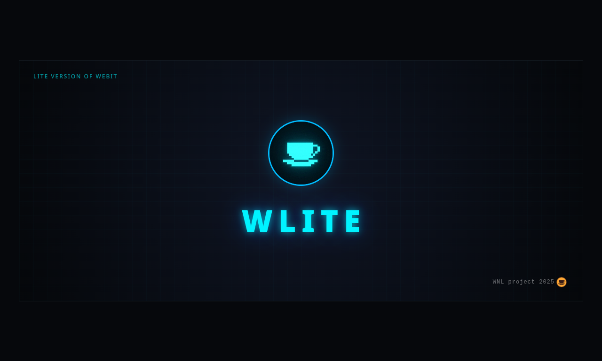

<div align="center">



# 🌐 Wlite — Web-Based Operating Environment

[](./LICENSE)
[](https://github.com/david9sargsian9s/SSR-forge-TS)
[](https://www.typescriptlang.org/)
[](https://developer.mozilla.org/en-US/docs/Web/JavaScript)
[](https://nodejs.org/)

<p align="center">
  <b>A lightweight, accessible, and highly flexible web operating environment designed for remote work, sandbox learning, and secure content administration.</b>
</p>

---
</div>

## 📌 Overview

**Wlite** is a fully open-source environment built to run directly in the browser. It addresses a critical gap in remote development tools by prioritizing **accessibility and extreme optimization**. 

Whether you are hosting a sandboxed environment to teach terminal basics or embedding a secure command console into massive databases and CMS platforms, Wlite delivers fluid performance without draining system resources.

> 🛠 **Ecosystem Note:** Wlite is being engineered as a foundational and inseparable component of the upcoming **WNL (Webit Not Linux)** ecosystem.

---

## ⚡ Key Features & Use Cases

* **💻 Low-Spec Optimization:** Built from the ground up to support developers with financial constraints. Wlite is heavily optimized to run smoothly on legacy hardware, weak processors, and unstable or low-speed internet networks.
* **🐚 UNIX Sandbox for Beginners:** An intuitive, risk-free web terminal environment with UNIX-like syntax. Perfect for educational platforms to teach newcomers command-line basics without risking damage to live production environments.
* **🔌 Flexible Administration:** Seamlessly integrates into enterprise databases or large-scale web platforms as a secure, highly customizable control pane for content management and system monitoring.
* **📦 100% Open Source:** Fully transparent code. Anyone can self-host, fork, customize, and deploy it for commercial or private use.

---

## 🏗 Technological Architecture & Core

Wlite splits its operational load efficiently using a combination of lightweight client architecture and highly performant rendering cycles.

* **Under the Hood:** Powered entirely by **[SSR Forge TS](https://github.com/your-username/ssr-forge-ts)** — our proprietary, custom Server-Side Rendering toolkit engineered natively in **TypeScript**. This integration guarantees blistering fast Initial Page Loads, minimal hydration lag, and superb performance on resource-constrained clients.
* **State & Security:** Sandboxed execution loops ensure that nested administrative tasks or terminal sessions do not compromise the host system's data integrity.

---
## 🚀 Getting Started *(Self-Hosting)*

### Prerequisites

Make sure you have Node.js and your favorite package manager installed.

### Installation

1. Clone the repository:

   ```bash
   git clone https://github.com/your-username/Wlite.git
   ```

2. Navigate into the project directory:

   ```bash
   cd Wlite
   ```

3. Install dependencies:

   ```bash
   npm install
   ```

4. Run the development server:

   ```bash
   npm run dev
   ```

---

## ⚖️ License

Distributed under the MIT License. Wlite is completely free to use, modify, distribute, and integrate into commercial systems. See the LICENSE file for more comprehensive details.
